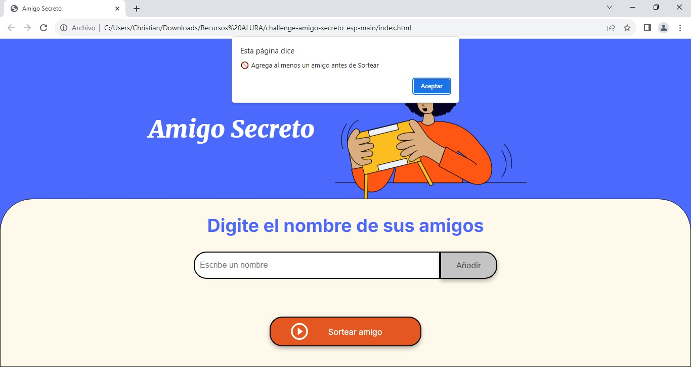
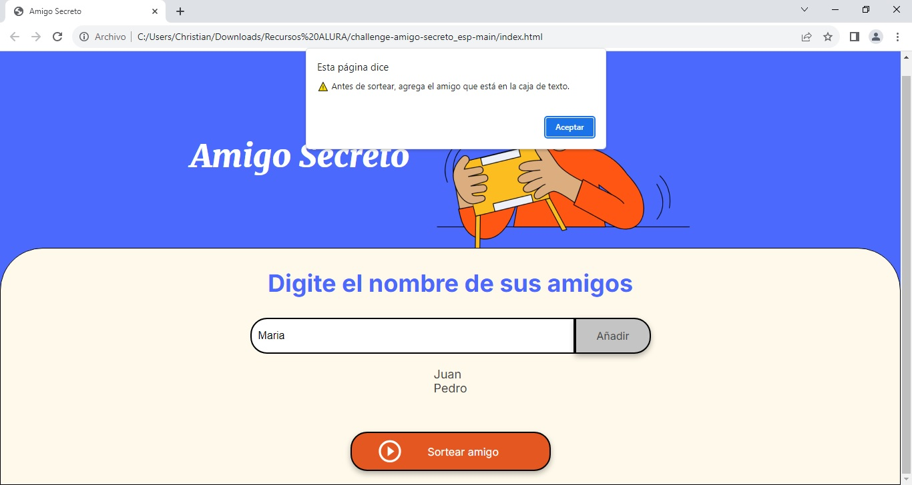
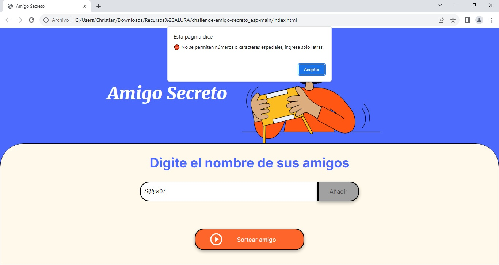

# 🎁 Amigo Secreto

## 📌 Descripción
Challenge creado por #AluraLatam que permite registrar nombres de amigos y realizar un sorteo aleatorio para determinar quién será el "Amigo Secreto". 

## 🚀 Funcionalidades
- Agregar nombres de amigos a una lista.
- Sortear un "Amigo Secreto" de manera aleatoria.
- Bloquear el input y el botón una vez finalizado el sorteo.

## 🎯 Funcionalidades Extras
- ✅ Validación para evitar que el sorteo inicie si no hay nombres en la lista.
  
  
  
- ✅ Bloqueo del sorteo si hay texto en el input.
  
  
  
- ✅ Restricción para solo permitir letras en el campo de texto (sin números ni caracteres especiales).
  
  

  - ✅ Restricción para que el input no este vacio.
  
  

## 🛠️ Tecnologías utilizadas
- **HTML**: Estructura de la página web.
- **CSS**: Estilos para mejorar la apariencia visual.
- **JavaScript**: Lógica del programación.

## 📂 Estructura del proyecto

AmigoSecreto/
│── index.html    # Interfaz del usuario
│── styles.css    # Estilos de la aplicación
│── app.js        # Lógica del sorteo
│── README.md     # Documentación del proyecto
└── assets/       # Carpeta para imágenes

## 📖 Instrucciones de uso
1. **Abrir el archivo `index.html` en un navegador.**
2. **Ingresa los nombres de los amigos uno por uno en el campo de texto y haz clic en 'Agregar'.**
3. **Cuando todos los nombres estén en la lista, hacer clic en "Sortear" para seleccionar un amigo secreto.**
4. **El input y el botón se bloquean una vez finalizado el sorteo.**

## 📌 Requisitos
Para ejecutar este proyecto solo necesitas un navegador web como:
- Google Chrome
- Mozilla Firefox
- Microsoft Edge
- Safari

---

📌 **Desarrollado por**
#AluraLatam
**Modificaciones y mejoras**
#Christian Peralta Camargo
